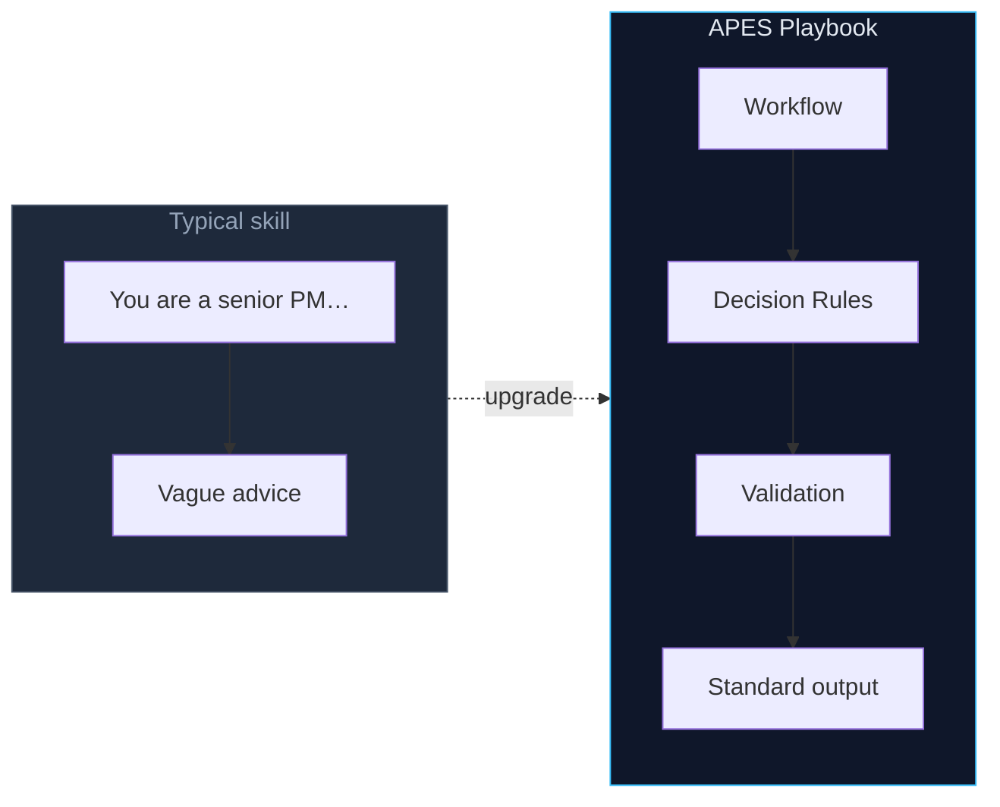
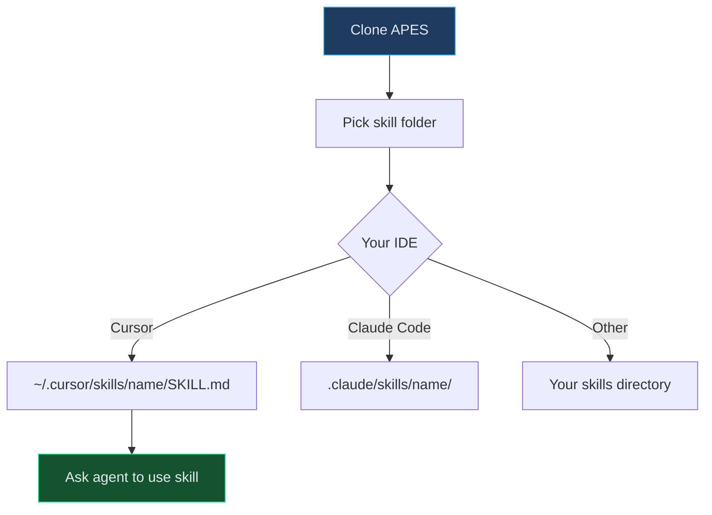
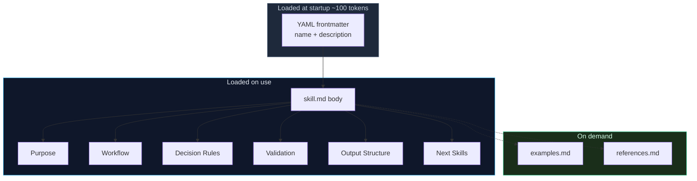
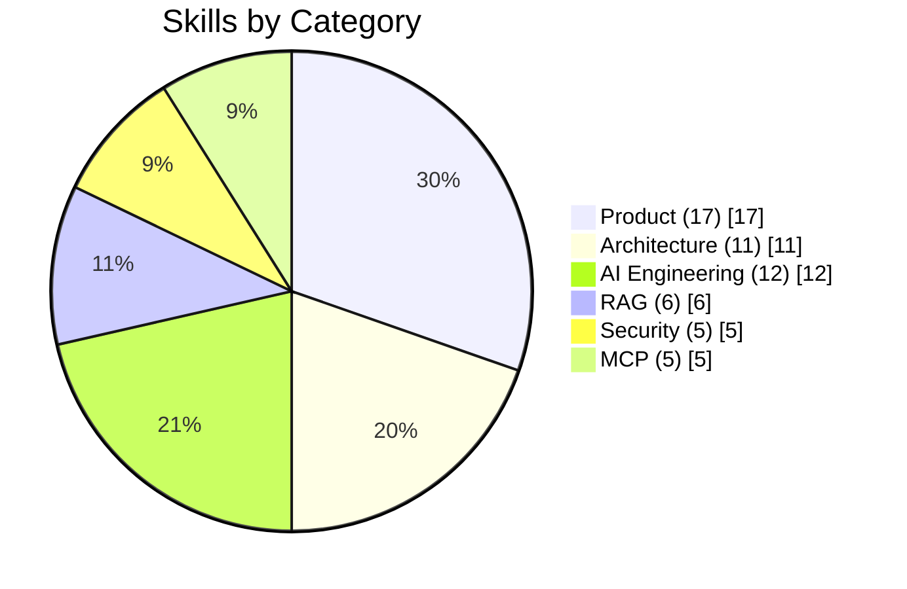
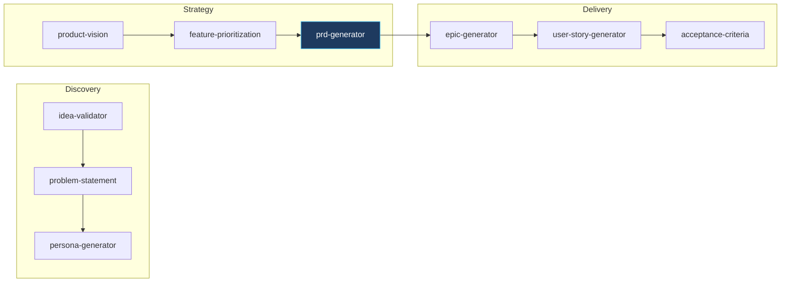
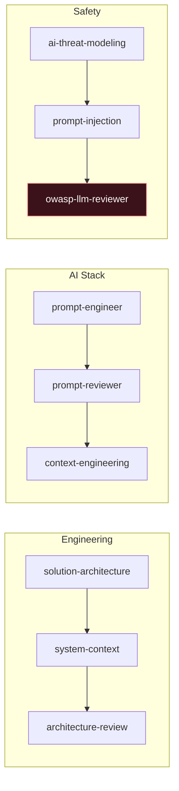

<p align="center">
  
</p>

<p align="center">
  <em>The largest open-source collection of professional Engineering Skills for AI Agents</em><br>
  Structured workflows for real work — not <em>"You are a senior engineer…"</em>
</p>

<p align="center">
  <a href="#install">Install</a> ·
  <a href="#skill-anatomy">Anatomy</a> ·
  <a href="#categories">Categories</a> ·
  <a href="#pipelines">Pipelines</a> ·
  <a href="catalog.json">Catalog</a>
</p>

---

## Why APES?




|              | Role prompt | APES Playbook         |
| ------------ | ----------- | --------------------- |
| Process      | None        | Step-by-step workflow |
| Quality gate | None        | Validation checklist  |
| Output       | Free-form   | Standard template     |
| Chaining     | None        | Next Skills links     |


---

## Install




### Cursor

```bash
git clone https://github.com/patonkikh/APES.git
mkdir -p ~/.cursor/skills/prd-generator
cp APES/skills/product/prd-generator/skill.md ~/.cursor/skills/prd-generator/SKILL.md
```

Then ask: *"Use prd-generator to write a PRD for …"*

### Claude Code

```bash
cp -r APES/skills/product/prd-generator ~/.claude/skills/prd-generator
# rename skill.md → SKILL.md if needed
```

### Other agents

Cline · Windsurf · Copilot · Roo Code — copy `skill.md` into your skills folder. Plain Markdown, [Agent Skills](https://agentskills.io/specification) frontmatter.

---

## Skill anatomy





| File                    | Install? | What it does                           |
| ----------------------- | -------- | -------------------------------------- |
| `skill.md` → `SKILL.md` | **Yes**  | Full playbook — the only required file |
| `examples.md`           | Optional | Worked input → output samples          |
| `references.md`         | Optional | Domain cheat sheets (OWASP, C4, MCP…)  |
| `README.md`             | No       | Browse on GitHub only                  |


---

## Categories





|     |
| --- |
|     |


### Product · 17

`[skills/product/](skills/product/)`

Discovery → Strategy → Delivery → Analytics

`idea-validator` · `competitive-analysis` · `prd-generator` · `analytics-instrumentation-planner`


### Architecture · 11

`[skills/architecture/](skills/architecture/)`

C4 · ADR · API design · Observability

`solution-architecture` · `observability-planner` · `adr-generator`


### AI · 12

`[skills/ai/](skills/ai/)`

Prompts · Agents · Memory · HITL

`prompt-engineer` · `agent-memory-designer` · `human-in-the-loop-designer` · `multi-agent-planner`


### RAG · 6

`[skills/rag/](skills/rag/)`

Ingestion · Retrieval pipelines

`knowledge-ingestion-planner` · `rag-architecture-designer` · `hybrid-search-advisor`


### Security · 5

`[skills/security/](skills/security/)`

OWASP LLM · Threats

`owasp-llm-reviewer` · `guardrails-builder`


### MCP · 5

`[skills/mcp/](skills/mcp/)`

Model Context Protocol

`mcp-server-generator` · `mcp-tool-generator`


**Full index:** `[catalog.json](catalog.json)`

---

## Pipelines


Skills chain via **Next Skills** in each playbook:







---

## Repository

```text
APES/
├── assets/              # Banner & visuals
├── CONTRIBUTING.md      # How to contribute
├── docs/
│   ├── CREATE_SKILL.md  # Step-by-step authoring guide
│   └── SKILL_STANDARD.md
├── scripts/
│   └── validate_skills.py
├── skills/
│   ├── _template/       # Copy to start a new skill
│   ├── product/         17 skills
│   ├── architecture/    11 skills
│   ├── ai/              12 skills
│   ├── rag/              6 skills
│   ├── security/         5 skills
│   └── mcp/              5 skills
├── catalog.json
├── LICENSE
└── README.md
```

---

## Contributing

Want to add a skill? Start here:

1. [CONTRIBUTING.md](CONTRIBUTING.md) — PR workflow and checklist  
2. [How to create a new Skill](docs/CREATE_SKILL.md) — step-by-step guide  
3. [Skill Template](skills/_template/skill.md) — copy-paste starting point  
4. [Skill Standard](docs/SKILL_STANDARD.md) — format rules (APES v1.1)

```bash
python scripts/validate_skills.py   # verify before opening a PR
```

---

## License

[MIT](LICENSE) © 2026 APES Contributors

Compatible with [Agent Skills](https://agentskills.io/specification) · Built for Cursor, Claude Code, and open agents