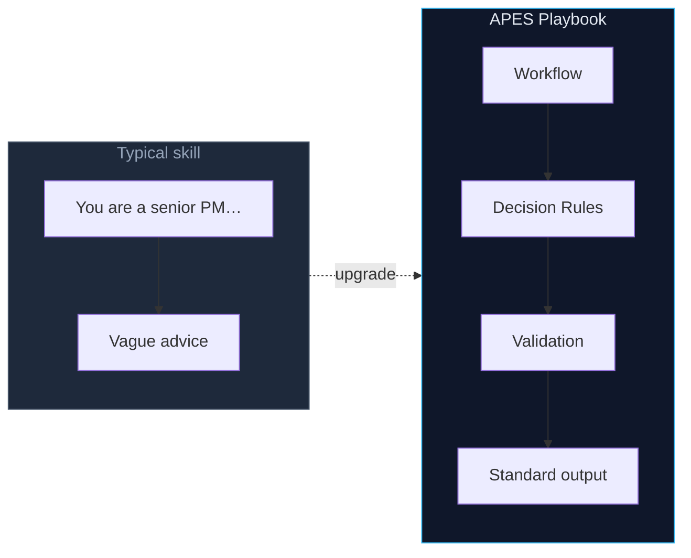
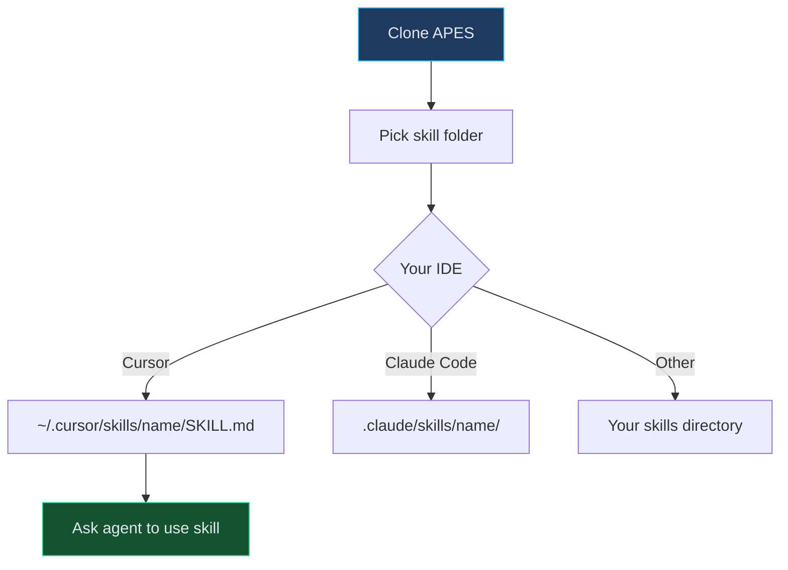
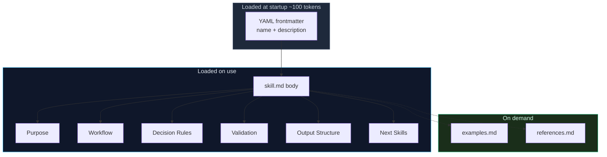
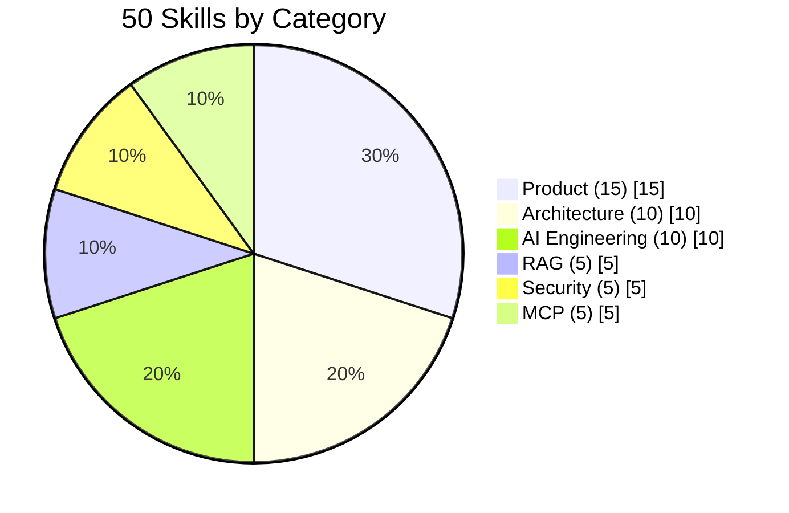
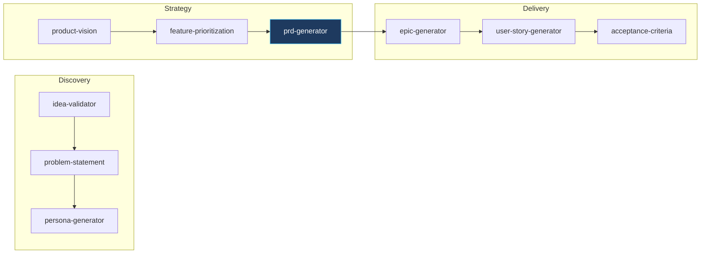
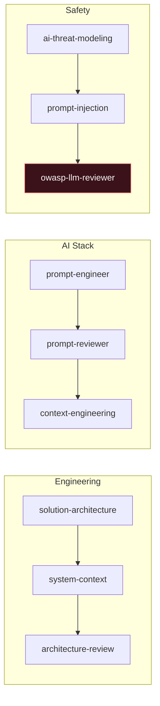

<p align="center">
  
</p>

<p align="center">
  <strong>50 Engineering Playbooks for AI agents</strong><br>
  Structured workflows for real work — not <em>"You are a senior engineer…"</em>
</p>

<p align="center">
  <a href="LICENSE"></a>
  <a href="catalog.json"></a>
  <a href="https://agentskills.io/specification"></a>
  <a href="https://github.com/patonkikh/APES"></a>
</p>

<p align="center">
  <a href="#install">Install</a> ·
  <a href="#skill-anatomy">Anatomy</a> ·
  <a href="#categories">Categories</a> ·
  <a href="#pipelines">Pipelines</a> ·
  <a href="catalog.json">Catalog</a>
</p>

---

## Why APES?



| | Role prompt | APES Playbook |
|---|-------------|---------------|
| Process | None | Step-by-step workflow |
| Quality gate | None | Validation checklist |
| Output | Free-form | Standard template |
| Chaining | None | Next Skills links |

---

## Install



### Cursor

```bash
git clone https://github.com/patonkikh/APES.git
mkdir -p ~/.cursor/skills/prd-generator
cp APES/skills/product/prd-generator/skill.md ~/.cursor/skills/prd-generator/SKILL.md
```

Then ask: *"Use prd-generator to write a PRD for …"*

### Claude Code

```bash
cp -r APES/skills/product/prd-generator ~/.claude/skills/prd-generator
# rename skill.md → SKILL.md if needed
```

### Other agents

Cline · Windsurf · Copilot · Roo Code — copy `skill.md` into your skills folder. Plain Markdown, [Agent Skills](https://agentskills.io/specification) frontmatter.

---

## Skill anatomy

<a id="skill-anatomy"></a>



| File | Install? | What it does |
|------|:--------:|--------------|
| `skill.md` → `SKILL.md` | **Yes** | Full playbook — the only required file |
| `examples.md` | Optional | Worked input → output samples |
| `references.md` | Optional | Domain cheat sheets (OWASP, C4, MCP…) |
| `README.md` | No | Browse on GitHub only |

---

## Categories

<a id="categories"></a>



<table>
<tr>
<td width="33%" valign="top">

### Product · 15

[`skills/product/`](skills/product/)

Discovery → Strategy → Delivery

`idea-validator` · `prd-generator` · `okr-builder` · `user-story-generator`

</td>
<td width="33%" valign="top">

### Architecture · 10

[`skills/architecture/`](skills/architecture/)

C4 · ADR · API design

`solution-architecture` · `adr-generator` · `api-designer`

</td>
<td width="33%" valign="top">

### AI · 10

[`skills/ai/`](skills/ai/)

Prompts · Agents · Eval

`prompt-engineer` · `multi-agent-planner` · `context-engineering`

</td>
</tr>
<tr>
<td valign="top">

### RAG · 5

[`skills/rag/`](skills/rag/)

Retrieval pipelines

`rag-architecture-designer` · `hybrid-search-advisor`

</td>
<td valign="top">

### Security · 5

[`skills/security/`](skills/security/)

OWASP LLM · Threats

`owasp-llm-reviewer` · `guardrails-builder`

</td>
<td valign="top">

### MCP · 5

[`skills/mcp/`](skills/mcp/)

Model Context Protocol

`mcp-server-generator` · `mcp-tool-generator`

</td>
</tr>
</table>

**Full index:** [`catalog.json`](catalog.json)

---

## Pipelines

<a id="pipelines"></a>

Skills chain via **Next Skills** in each playbook:





---

## Repository

```text
APES/
├── assets/           # Banner & visuals
├── skills/
│   ├── product/          15 skills
│   ├── architecture/     10 skills
│   ├── ai/                 10 skills
│   ├── rag/                 5 skills
│   ├── security/            5 skills
│   └── mcp/                 5 skills
├── catalog.json
├── LICENSE
└── README.md
```

---

## License

[MIT](LICENSE) © 2026 APES Contributors

<p align="center">
  <sub>Compatible with <a href="https://agentskills.io/specification">Agent Skills</a> · Built for Cursor, Claude Code, and open agents</sub>
</p>
