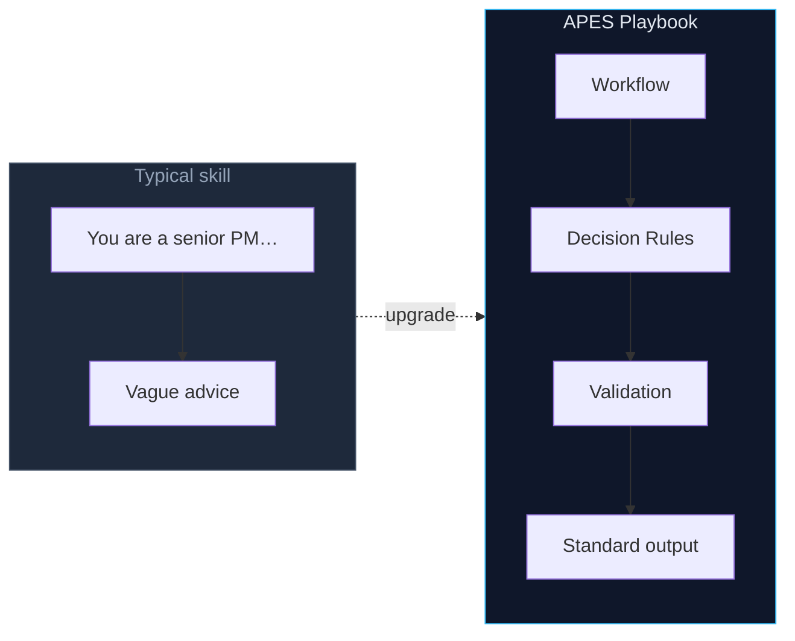
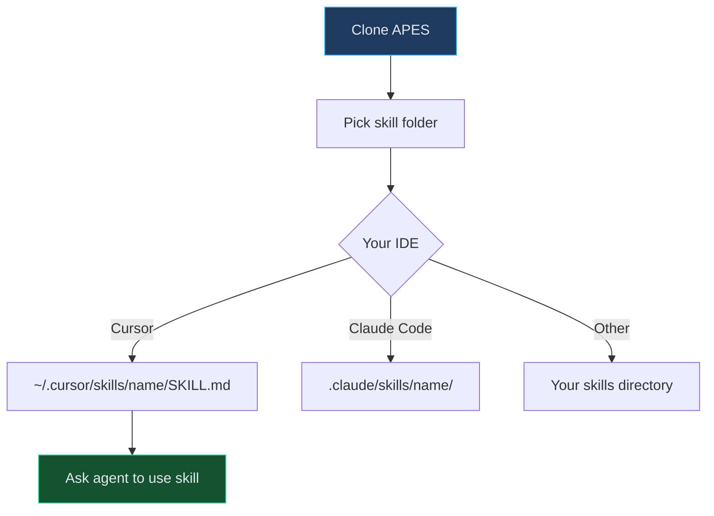
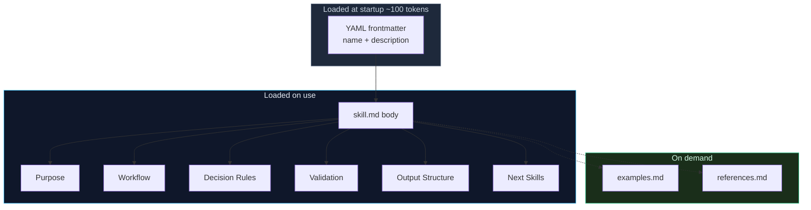
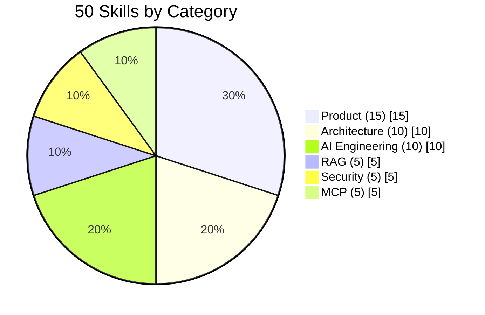
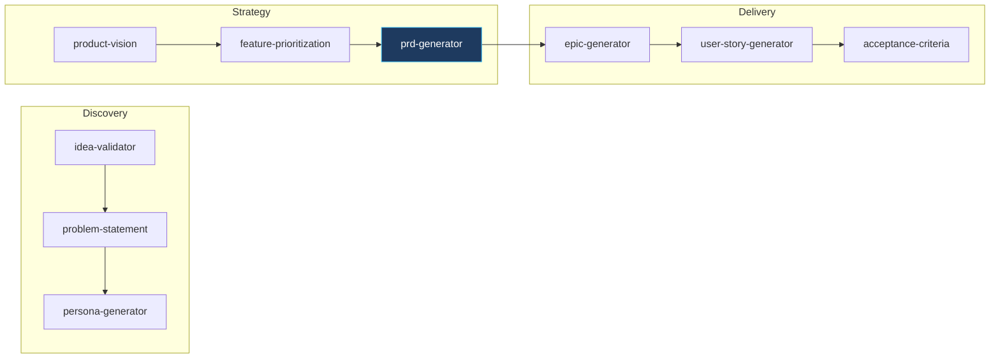
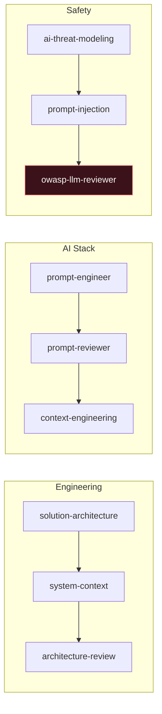

*The largest open-source collection of professional Engineering Skills for AI Agentse* 
 
Structured workflows for real work — not *"You are a senior engineer…"*


[Install](#install) · [Anatomy](#skill-anatomy) · [Categories](#categories) · [Pipelines](#pipelines) · [Catalog](catalog.json)

---

## Why APES?




|              | Role prompt | APES Playbook         |
| ------------ | ----------- | --------------------- |
| Process      | None        | Step-by-step workflow |
| Quality gate | None        | Validation checklist  |
| Output       | Free-form   | Standard template     |
| Chaining     | None        | Next Skills links     |


---

## Install




### Cursor

```bash
git clone https://github.com/patonkikh/APES.git
mkdir -p ~/.cursor/skills/prd-generator
cp APES/skills/product/prd-generator/skill.md ~/.cursor/skills/prd-generator/SKILL.md
```

Then ask: *"Use prd-generator to write a PRD for …"*

### Claude Code

```bash
cp -r APES/skills/product/prd-generator ~/.claude/skills/prd-generator
# rename skill.md → SKILL.md if needed
```

### Other agents

Cline · Windsurf · Copilot · Roo Code — copy `skill.md` into your skills folder. Plain Markdown, [Agent Skills](https://agentskills.io/specification) frontmatter.

---

## Skill anatomy





| File                    | Install? | What it does                           |
| ----------------------- | -------- | -------------------------------------- |
| `skill.md` → `SKILL.md` | **Yes**  | Full playbook — the only required file |
| `examples.md`           | Optional | Worked input → output samples          |
| `references.md`         | Optional | Domain cheat sheets (OWASP, C4, MCP…)  |
| `README.md`             | No       | Browse on GitHub only                  |


---

## Categories





|     |
| --- |
|     |


### Product · 15

`[skills/product/](skills/product/)`

Discovery → Strategy → Delivery

`idea-validator` · `prd-generator` · `okr-builder` · `user-story-generator`


### Architecture · 10

`[skills/architecture/](skills/architecture/)`

C4 · ADR · API design

`solution-architecture` · `adr-generator` · `api-designer`


### AI · 10

`[skills/ai/](skills/ai/)`

Prompts · Agents · Eval

`prompt-engineer` · `multi-agent-planner` · `context-engineering`


### RAG · 5

`[skills/rag/](skills/rag/)`

Retrieval pipelines

`rag-architecture-designer` · `hybrid-search-advisor`


### Security · 5

`[skills/security/](skills/security/)`

OWASP LLM · Threats

`owasp-llm-reviewer` · `guardrails-builder`


### MCP · 5

`[skills/mcp/](skills/mcp/)`

Model Context Protocol

`mcp-server-generator` · `mcp-tool-generator`


**Full index:** `[catalog.json](catalog.json)`

---

## Pipelines


Skills chain via **Next Skills** in each playbook:







---

## Repository

```text
APES/
├── assets/           # Banner & visuals
├── skills/
│   ├── product/          15 skills
│   ├── architecture/     10 skills
│   ├── ai/                 10 skills
│   ├── rag/                 5 skills
│   ├── security/            5 skills
│   └── mcp/                 5 skills
├── catalog.json
├── LICENSE
└── README.md
```

---

## License

[MIT](LICENSE) © 2026 APES Contributors

Compatible with [Agent Skills](https://agentskills.io/specification) · Built for Cursor, Claude Code, and open agents