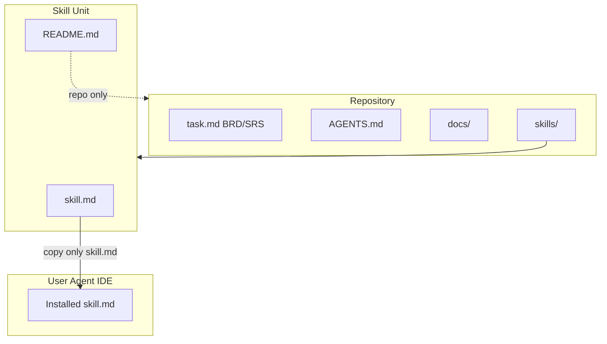

# APES Platform Architecture

**Версия:** 1.0  
**Дата:** 2026-07-01  
**Статус:** Этап 1

---

## 1. Обзор

APES — библиотека Engineering Playbooks, распространяемых как одиночные Markdown-файлы `skill.md`. Репозиторий содержит исходники, стандарты, ADR и README для каждого Skill.



---

## 2. Принципы архитектуры

| Принцип | Реализация |
|---------|------------|
| Single-file distribution | Пользователь устанавливает только `skill.md` |
| Platform-agnostic | Без YAML frontmatter, без IDE-specific синтаксиса |
| One task per Skill | Каждый Skill решает одну инженерную задачу |
| Engineering Playbook | Workflow + Decision Rules + Validation, не Role Play |
| Skill chains | Секция Next Skills связывает Skills в pipeline |
| Progressive repo docs | Детали в README skill и docs/, не в skill.md |

---

## 3. Структура каталогов

```text
skills/
  _template/           # Эталонный шаблон
  product/             # Product discovery, strategy, delivery
  architecture/        # Solution architecture, ADR, API
  ai/                  # AI engineering
  rag/                 # RAG systems
  security/            # AI security
  mcp/                 # MCP tooling
  jira/                # Jira workflows
  enterprise/          # Enterprise architecture
  startup/             # Startup product
  github/              # OSS and GitHub workflows
```

Каждый Skill:

```text
skills/<category>/<skill-name>/
  skill.md      # Устанавливаемый файл
  README.md     # Примеры, changelog, контекст (только репозиторий)
```

---

## 4. Skill lifecycle

1. **Author** — агент создаёт skill.md по SKILL_STANDARD из _template
2. **Review** — чеклист Validation, anti-patterns, Next Skills chain
3. **Commit** — один skill = один коммит + обновление ROADMAP/TODO/CHANGELOG
4. **Publish** — пользователь копирует skill.md в свою IDE

---

## 5. Документация репозитория

| Документ | Назначение |
|----------|------------|
| task.md | BRD/SRS, не менять без согласования |
| AGENTS.md | Workflow для агентов разработки |
| ROADMAP.md | Этапы 1–4 |
| TODO.md | Активные задачи |
| CHANGELOG.md | История изменений |
| docs/SKILL_STANDARD.md | Стандарт Playbook |
| docs/adr/ | Architecture Decision Records |

---

## 6. Приоритет категорий (разработка)

1. Product → 2. Architecture → 3. AI → 4. RAG → 5. AI Security → 6. MCP → 7. Jira → 8. Enterprise → 9. Startup → 10. GitHub

---

## 7. Совместимость с IDE

| IDE | Установка | Примечание |
|-----|-----------|------------|
| Cursor | `~/.cursor/skills/<name>/SKILL.md` | Переименовать skill.md → SKILL.md |
| Claude Code | `.claude/skills/` | Следовать документации Claude |
| Cline / Roo | Skills directory per docs | Копировать skill.md |
| GitHub Copilot | Agent instructions | Копировать содержимое skill.md |

Подробности: [adr/0001-skill-file-format.md](adr/0001-skill-file-format.md).

---

## 8. Масштабирование (Этапы 2–4)

- **Этап 2:** CI-валидация skill.md по SKILL_STANDARD (lint script)
- **Этап 3:** Индекс Skills (catalog.json) для поиска и Next Skills graph
- **Этап 4:** Генератор Skills из шаблона + human review gate
