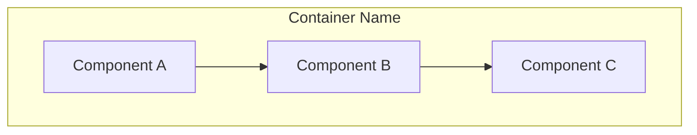

# Component Diagram Builder

# Purpose

Produce a C4 Level 3 (Component) diagram for a selected container, showing internal components, responsibilities, and dependencies.

**Input:** Container diagram, target container name, component responsibilities (optional)  
**Output:** Component diagram document with Mermaid diagram and component inventory

---

# Workflow

## Step 1: Select target container

Confirm which container to decompose:

- One container per Skill execution
- Must exist in container diagram
- Identify primary technology/framework

## Step 2: Identify components

Decompose container into logical components:

| Component | Type | Responsibility |
|-----------|------|----------------|

Types: controller, service, repository, adapter, domain module, UI module.

Components are code-level groupings, not individual classes.

## Step 3: Map component interactions

| From | To | Interface | Purpose |
|------|----|-----------|---------|

Show dependency direction. Avoid circular dependencies.

## Step 4: Draw component diagram



Keep inside one container boundary.

## Step 5: Map to patterns

Identify applied patterns:

- Layered architecture, hexagonal, CQRS, repository, etc.
- Note pattern violations or technical debt

## Step 6: Validate

Run Validation checklist.

---

# Decision Rules

| Condition | Action |
|-----------|--------|
| No container diagram | Stop; run container-diagram-builder |
| Container not found | Ask user to select valid container |
| More than 15 components | Group into sub-modules; simplify diagram |
| Circular dependencies | Refactor component boundaries; flag as debt |
| Component = single class | Merge into logical module |

---

# Validation

- [ ] Target container identified from container diagram
- [ ] 3–12 components with clear responsibilities
- [ ] All interactions documented with direction
- [ ] Mermaid diagram within container boundary
- [ ] No other containers' internals shown
- [ ] Applied patterns noted
- [ ] Circular dependencies flagged if present

---

# Anti-patterns

- **Class diagram as component diagram** — every class as a node.
- **God component** — single component doing everything.
- **Leaking containers** — showing other containers' internals.
- **Unlabeled dependencies** — arrows without interface description.
- **Missing adapters** — external calls directly from domain logic.

---

# Best Practices

- Follow C4 Level 3 scope strictly.
- Align with DDD bounded context if applicable.
- Separate adapters from domain components.
- One diagram per complex container; simple containers may need fewer components.
- Link components to FR/NFR responsibilities.

---

# Output Structure

```markdown
# Component Diagram: [Container Name]

## Container Context
- **Technology:** [stack]
- **Responsibility:** [from container diagram]

## Components
| Component | Type | Responsibility |
|-----------|------|----------------|

## Interactions
| From | To | Interface | Purpose |
|------|----|-----------|---------|

## Diagram
```mermaid
[diagram]
```

## Patterns Applied
- [Pattern]: [where]

## Technical Debt
| Issue | Impact | Recommendation |
|-------|--------|----------------|
```

---

# Next Skills

| Outcome | Recommended Skill |
|---------|-------------------|
| Design container API | `architecture/api-designer` |
| Review component design | `architecture/architecture-review` |
| Analyze data through components | `architecture/data-flow-analyzer` |
| Other containers | `architecture/component-diagram-builder` |
