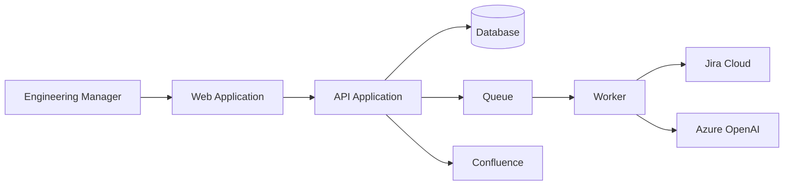

# Container Diagram Builder — Worked Examples

---

## Example 1: C4 Level 2 containers

### Input

```text
System: Retro Generator
Actors: Engineering Manager (user), Jira Cloud, Confluence, Azure OpenAI
Must capabilities: OAuth, async generation, export
```

### Output (excerpt)

```markdown
# Container Diagram: Retro Generator

## Containers
| Container | Technology | Responsibility |
|-----------|------------|----------------|
| Web Application | React SPA | UI, OAuth callback |
| API Application | Node.js | REST API, auth |
| Worker | Node.js | Async retro generation |
| Database | PostgreSQL | Users, tokens, drafts |
| Queue | AWS SQS | Job dispatch |

## Diagram


## External dependencies
| System | Protocol | Data exchanged |
|--------|----------|----------------|
| Jira Cloud | HTTPS REST | Sprint/issues (read) |
| Confluence | HTTPS REST | Page create (write) |
```

---

## Example 2: Missing system context

### Input

```text
Draw containers for payment service only, no context diagram
```

### Expected behavior

Stop; run `architecture/system-context-builder` first.

---

## Example 3: Component-level detail in container diagram

### Expected behavior

Flag scope creep — defer class/module detail to `component-diagram-builder`.
