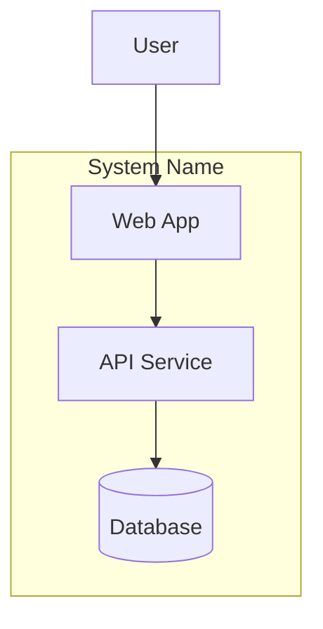

# Container Diagram Builder

# Purpose

Produce a C4 Level 2 (Container) diagram decomposing the system into deployable/runnable units with technology choices and communication paths.

**Input:** System context diagram, solution architecture  
**Output:** Container diagram document with Mermaid diagram, container inventory, and communication matrix

---

# Workflow

## Step 1: Map logical components to containers

From solution architecture, identify containers:

- Web application, mobile app, API service, worker, database, cache, message broker, file storage

Each container must:

- Be independently deployable or runnable
- Have one primary technology
- Have clear responsibility

## Step 2: Define container inventory

| Container | Type | Technology | Responsibility | Owner |
|-----------|------|------------|----------------|-------|

Types: web app, mobile, API, worker, database, cache, queue, gateway.

## Step 3: Document container communication

| Source | Target | Protocol | Purpose | Sync/Async | Auth |
|--------|--------|----------|---------|------------|------|

## Step 4: Draw container diagram



Place containers inside system boundary. External actors and systems outside.

## Step 5: Map to quality attributes

For each container, note NFR implications:

- Scaling approach
- Security boundary
- Data persistence

## Step 6: Validate

Run Validation checklist.

---

# Decision Rules

| Condition | Action |
|-----------|--------|
| No system context available | Stop; run system-context-builder first |
| Component not deployable | Merge into parent container or split differently |
| Direct DB access from multiple containers | Document pattern; flag if violating bounded context |
| Technology unspecified | Recommend based on solution architecture; mark as proposal |
| More than 12 containers | Group into subsystems with nested diagrams |

---

# Validation

- [ ] Every solution architecture component maps to a container
- [ ] Each container has type, technology, responsibility
- [ ] Communication matrix covers all container pairs that interact
- [ ] Mermaid diagram shows system boundary
- [ ] External actors/systems from context diagram present
- [ ] No component-level (C4 L3) detail inside diagram
- [ ] Auth method noted for external-facing protocols

---

# Anti-patterns

- **Container = class** — fine-grained code modules shown as containers.
- **Missing data stores** — API without database when persistence required.
- **Spaghetti diagram** — unordered arrows without protocol labels.
- **Technology leakage** — framework names without container purpose.
- **Skipping async paths** — only showing sync HTTP, missing queues/workers.

---

# Best Practices

- Follow C4 Level 2 conventions strictly.
- One technology per container (primary).
- Show both sync and async integration paths.
- Align container names with deployment units.
- Reference FR/NFR IDs in container responsibilities.

---

# Output Structure

```markdown
# Container Diagram: [System Name]

## Container Inventory
| Container | Type | Technology | Responsibility |
|-----------|------|------------|----------------|

## Communication Matrix
| Source | Target | Protocol | Purpose | Sync/Async |
|--------|--------|----------|---------|------------|

## Container Diagram
```mermaid
[diagram]
```

## NFR Mapping
| Container | Scaling | Security | Persistence |
|-----------|---------|----------|-------------|

## Open Questions
- [ ] [Question]
```

---

# Next Skills

| Outcome | Recommended Skill |
|---------|-------------------|
| Document architecture decisions | `architecture/adr-generator` |
| Design container APIs | `architecture/api-designer` |
| Review full architecture | `architecture/architecture-review` |
| Missing context | `architecture/system-context-builder` |
