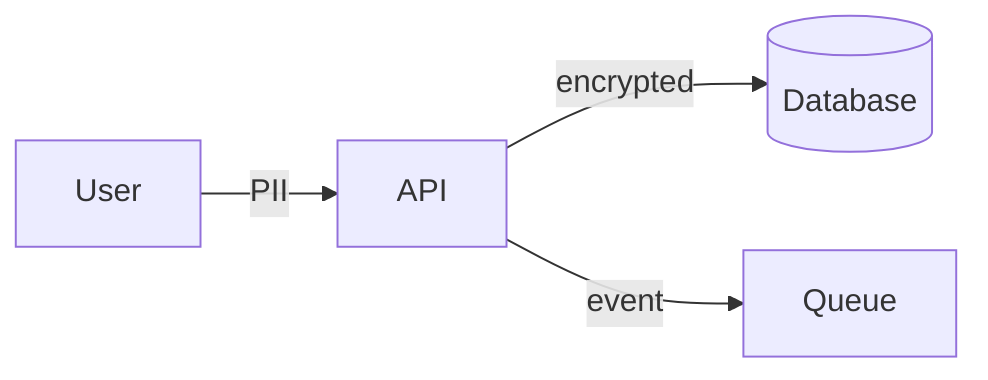

# Data Flow Analyzer

# Purpose

Analyze and document data flows across the system: data origins, transformations, storage, retention, and compliance boundaries.

**Input:** Container diagram, integration plan, data entities (optional), compliance requirements  
**Output:** Data Flow document with DFD-style diagrams, data inventory, and privacy classification

---

# Workflow

## Step 1: Identify data entities

List core data entities:

| Entity | Description | Owner container | Sensitivity |
|--------|-------------|-----------------|-------------|

Sensitivity: Public, Internal, Confidential, PII, PHI, PCI.

## Step 2: Map data origins and sinks

For each entity:

- Source (user input, external system, generated)
- Storage locations (database, cache, file, queue)
- Consumers (containers, external systems)
- Retention period

## Step 3: Document transformations

| Step | Input | Transformation | Output | Container |
|------|-------|----------------|--------|-----------|

Include validation, enrichment, aggregation, anonymization.

## Step 4: Draw data flow diagram



Label flows with data type and protocol. Mark trust boundary crossings.

## Step 5: Compliance analysis

| Requirement | Data affected | Control | Gap |
|-------------|---------------|---------|-----|

Cover: GDPR, encryption at rest/transit, right to deletion, audit logging.

## Step 6: Identify risks

- Data duplication across stores
- Unencrypted sensitive flows
- Missing retention policy
- Cross-border transfer

## Step 7: Validate

Run Validation checklist.

---

# Decision Rules

| Condition | Action |
|-----------|--------|
| No container/integration context | Stop; run container-diagram-builder or integration-planner |
| PII without classification | Classify before proceeding; flag if unknown |
| Sensitive data in logs | Flag as Critical finding |
| Retention undefined for PII | Recommend policy; mark as gap |
| Data flow crosses trust boundary unencrypted | Flag as High severity |

---

# Validation

- [ ] All core entities inventoried with sensitivity
- [ ] Each entity has source, storage, consumers
- [ ] Transformations documented for sensitive data
- [ ] DFD diagram with labeled flows
- [ ] Trust boundaries marked
- [ ] Compliance requirements checked
- [ ] ≥3 data risks identified with severity
- [ ] Retention policy stated or flagged as gap

---

# Anti-patterns

- **Data swamp** — duplicate entities across stores without sync strategy.
- **PII everywhere** — sensitive data in logs, caches, analytics without controls.
- **Missing lineage** — unknown data origin for compliance-critical fields.
- **Implicit retention** — data kept forever by default.
- **Diagram without labels** — arrows without data type or volume indication.

---

# Best Practices

- Use STRIDE or LINDDUN for threat modeling sensitive flows.
- Document encryption per flow crossing trust boundaries.
- Align with integration-planner contracts.
- Map to GDPR lawful basis where applicable.
- Separate analytics data flows from operational flows.

---

# Output Structure

```markdown
# Data Flow Analysis: [System Name]

## Data Inventory
| Entity | Sensitivity | Owner | Storage | Retention |
|--------|-------------|-------|---------|-----------|

## Transformations
| Step | Input | Transform | Output |
|------|-------|-----------|--------|

## Data Flow Diagram
```mermaid
[diagram]
```

## Trust Boundaries
| Boundary | Data crossing | Controls |
|----------|---------------|----------|

## Compliance
| Requirement | Status | Gap |
|-------------|--------|-----|

## Risks
| ID | Severity | Finding | Remediation |
|----|----------|---------|-------------|
```

---

# Next Skills

| Outcome | Recommended Skill |
|---------|-------------------|
| Plan scaling for data layer | `architecture/scalability-advisor` |
| Review security | `architecture/architecture-review` |
| Update integration plan | `architecture/integration-planner` |
| Document data decision | `architecture/adr-generator` |
