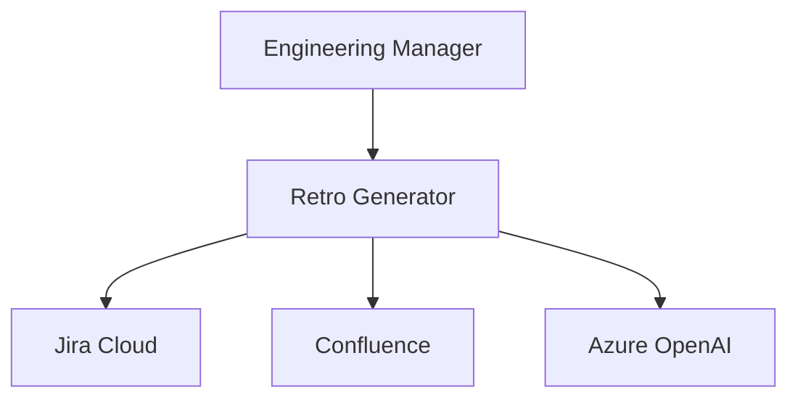

# System Context Builder — Worked Examples

---

## Example 1: C4 Level 1 context

### Input

```text
Product: Retro Generator SaaS
Users: Engineering managers
External systems: Jira Cloud, Confluence, identity via company SSO (future)
```

### Output (excerpt)

```markdown
# System Context: Retro Generator

## System under design
**Retro Generator** — helps engineering managers produce sprint retrospectives from Jira data.

## People
| Actor | Interaction |
|-------|-------------|
| Engineering Manager | Creates/edits/exports retros |
| Platform Admin (internal) | Monitors usage, support |

## External Systems
| System | Relationship |
|--------|--------------|
| Jira Cloud | Source of sprint data (OAuth) |
| Confluence | Export destination |
| Azure OpenAI | AI generation (via platform) |

## Context Diagram


## Scope boundaries
- **In scope:** EM-facing product
- **Out of scope:** Jira administration, Confluence space provisioning
```

---

## Example 2: Too many systems

### Input

```text
Also integrate Slack, Teams, GitHub, GitLab, Linear, Notion, email...
```

### Expected behavior

Group into phases; context diagram shows MVP externals only; backlog noted for Phase 2.

---

## Example 3: Missing primary actor

### Expected behavior

Stop; identify primary user before drawing context.
