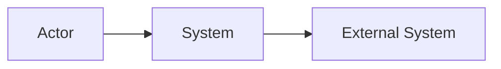

# System Context Builder

# Purpose

Produce a C4 Level 1 (System Context) diagram and description showing the system, its users, and external dependencies.

**Input:** Solution architecture or PRD, stakeholder list (optional)  
**Output:** System Context document with Mermaid diagram, actor descriptions, and external system inventory

---

# Workflow

## Step 1: Identify the system boundary

Define:

- System name and one-sentence purpose
- What is inside the system boundary
- What is explicitly outside

## Step 2: Identify actors (users and personas)

List all human actors:

| Actor | Type (user/admin/operator) | Goal | Interaction |
|-------|------------------------------|------|-------------|

Map to personas from product skills if available.

## Step 3: Identify external systems

List all external systems the solution interacts with:

| System | Purpose | Protocol | Data exchanged | Owned by |
|--------|---------|----------|----------------|----------|

Include: identity providers, payment, email, analytics, third-party APIs.

## Step 4: Draw context diagram

Use Mermaid C4-style or flowchart:



Rules:

- One central system node
- Actors on the left/top
- External systems on the right/bottom
- Label every arrow with action or data flow

## Step 5: Document trust boundaries

Identify security boundaries between system and externals.

## Step 6: Validate

Run Validation checklist.

---

# Decision Rules

| Condition | Action |
|-----------|--------|
| No solution architecture or PRD | Stop; request input or run solution-architecture |
| Actor overlaps with external system | Clarify: human actor vs software system |
| More than 10 external systems | Group into categories; detail in appendix |
| Undocumented integration | Mark as "TBD"; add to open questions |
| System boundary unclear | Ask user to confirm scope before diagramming |

---

# Validation

- [ ] System boundary explicitly defined
- [ ] All actors from PRD/user flows represented
- [ ] All external integrations listed
- [ ] Mermaid diagram renders with labeled relationships
- [ ] Trust boundaries identified
- [ ] No container-level detail (defer to container-diagram-builder)
- [ ] Diagram matches written descriptions

---

# Anti-patterns

- **Missing externals** — ignoring auth provider, payment, email services.
- **Container in context** — showing databases or internal services at Level 1.
- **Unlabeled arrows** — relationships without action/data description.
- **Actor = system** — treating batch jobs or admin tools as users without clarity.
- **Scope creep** — including future-phase systems without marking as planned.

---

# Best Practices

- Follow C4 Model Level 1 strictly.
- Use consistent naming from solution architecture components at abstract level.
- Mark planned vs current integrations.
- Align actors with PRD user flows.
- Keep diagram readable: max 7±2 nodes.

---

# Output Structure

```markdown
# System Context: [System Name]

## System
**Name:** [name]
**Purpose:** [one sentence]
**Boundary:** [what's in/out]

## Actors
| Actor | Type | Goal | Interactions |
|-------|------|------|--------------|

## External Systems
| System | Purpose | Protocol | Data | Status |
|--------|---------|----------|------|--------|

## Context Diagram
```mermaid
[diagram]
```

## Trust Boundaries
| Boundary | Controls |
|----------|----------|

## Open Questions
- [ ] [Question]
```

---

# Next Skills

| Outcome | Recommended Skill |
|---------|-------------------|
| Decompose into containers | `architecture/container-diagram-builder` |
| Design APIs for externals | `architecture/api-designer` |
| Update solution architecture | `architecture/solution-architecture` |
| Record integration decisions | `architecture/adr-generator` |
